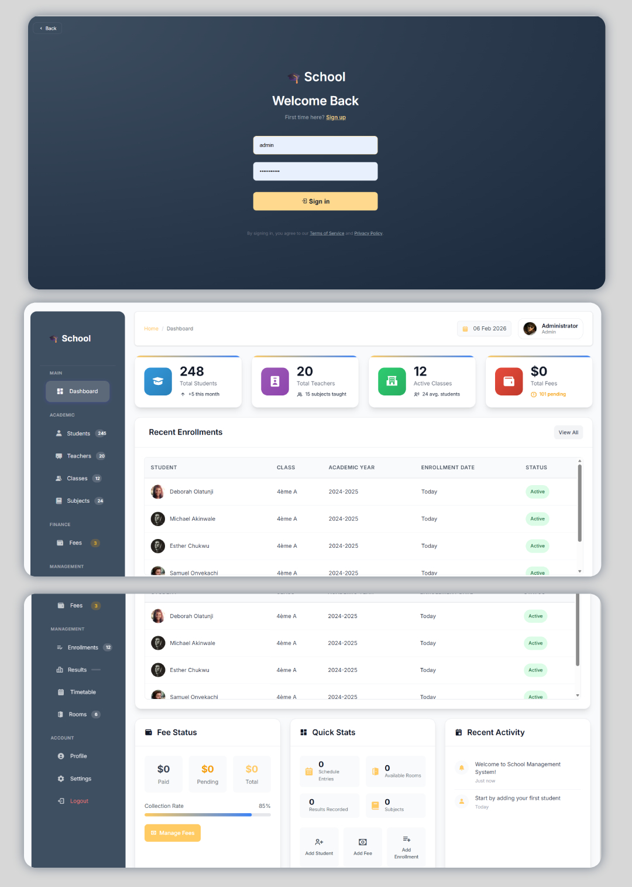

# 🎓 School Management System – Admin Dashboard

A modern school management web application built with Flask and SQLite, HTML and CSS, featuring a clean and intuitive admin dashboard for managing academic and administrative data in one place.

This project goes beyond a basic CRUD app and focuses on realistic school workflows, data consistency, and UX-oriented design.

## Project Preview

##  Key Features
### Authentication
- Secure admin login system
- Session-based access control
- Protected routes using decorators

### Dashboard
- Global statistics (students, teachers, classes)
- Pending fees overview
- Recent enrollments activity

### Academic Management
- Students: add, edit, delete, enrollment tracking
- Teachers: profiles, qualifications, assignments
- Classes: levels, sections
- Subjects: coefficients, class & teacher association
- Enrollments: students ↔ classes ↔ academic year
- Results: semester-based grading system
- Bulletins: automatic average calculation (weighted by coefficients)

### Timetable Management
- Class schedules by day and time
- Teacher & room assignment
- Structured weekly timetable view

### Infrastructure
- Room management (capacity, location)

### Finance
- School fees tracking
- Paid / unpaid / remaining amounts
- Financial overview per student and class

### Account
- Profile page
- Settings
- Help & support pages

## Tech Stack 
- Backend: Python, Flask
- Database: SQLite
- Frontend: HTML, CSS, JavaScript
- Security: Werkzeug password hashing
- Architecture: MVC-style Flask application

## Getting Started

### Clone the repository
git clone https://github.com/your-username/school-management-system.git
cd school-management-system

### Install dependencies
pip install flask werkzeug

### Run the application
python app.py

The app will be available at: 
http://127.0.0.1:5000

### Default Admin Credentials
Username: admin
Password: password123

## 👤 Author
Shakespeare Gbandi
Data Scientist & Software Engineer
Interested in data-driven systems, and intelligent applications

## License
This project is for educational and portfolio purposes